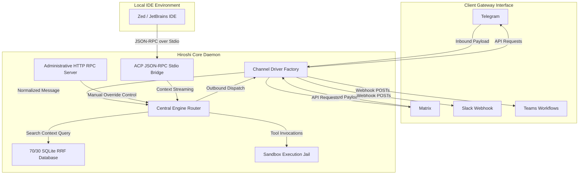

# Hiroshi OS

Hiroshi is an assistant that lets you control your computer, manage files, and run commands by simply chatting with it. If you are looking for an alternative to OpenClaw, Hiroshi does the same job but runs directly on your own computer. All of your files, chat history, and API keys stay completely private on your local machine.

You can connect Hiroshi to chat apps like Telegram, Discord, and Matrix to control your computer remotely, or use it directly inside code editors like Zed to help you build software.



## Detailed Architectural Modules

### 1. Pluggable Channel Driver Factory
Hiroshi handles communication across multiple platforms using a polymorphic driver model. Instead of hardcoding API endpoints, the core engine interacts with the ChannelDriver trait. This allows the system to spin up or scale down chat gateways dynamically depending on the configurations inside your TOML file:
* **Matrix Driver**: Manages a persistent HTTP long-polling synchronization loop targeting Matrix client sync paths. It filters for m.room.message bodies of type m.text and converts them into normalized channel events.
* **Microsoft Teams Driver**: Automatically maps markdown payloads into Teams-compliant Adaptive Card structures and dispatches them over HTTP POST to target automation Workflows.
* **Slack Webhooks & Mattermost**: Lightweight outbound REST drivers that stream heartbeat diagnostics, logs, and alerts without requiring heavy bot configuration profiles.

### 2. The Agent Client Protocol (ACP)
For developers looking to integrate Hiroshi as an backend runtime for editors like Zed or JetBrains, the system implements the standard Agent Client Protocol. Communicating over standard I/O (stdio) pipelines using JSON-RPC 2.0 frames, the ACP bridge manages conversation history loading, session state resumption, and streaming token prompts directly to active workspace panels.

### 3. Administrative HTTP RPC Control Plane
Bypassing model routing paths entirely, the administrative HTTP RPC server (listening on 127.0.0.1:3999) allows external applications to inspect active status updates, trigger screen capture buffers using the vision engine, and push manual messages directly to gateway queues. Every inbound packet is checked against a cryptographic bearer token to prevent unauthorized local overrides.

### 4. Sandbox Filesystem Matrix
Security is a core design pillar. When Hiroshi executes system tool calls, all write, read, move, and list operations are strictly gated. The sandboxed explorer resolves paths against Dunce canonicalization checks. Any symbolic link reference that attempts to breakout or escape the boundary is rejected instantly.

### 5. Scriptable Cron Scheduler
Hiroshi contains a background cron engine that reads standard crontab notation. Operators can schedule repetitive workflows, workspace backups, or linting sweeps to run inside the sandbox. Command execution output is captured and routed to allowlisted notification channels.

### 6. 70/30 Hybrid Search Database
Hiroshi stores memories and transaction logs inside a local SQLite database. When performing context lookups, it runs a 70/30 Reciprocal Rank Fusion (RRF) algorithm:
* **70% Weight**: SQLite FTS5 search index matches.
* **30% Weight**: Cosine similarity calculations against local vector embeddings.

## Installation & Setup

### Building from Source
Ensure you have the Rust toolchain (Rust 1.75+) installed:
```bash
cargo build --release
```

### Running Tests
Execute the complete validation suite to confirm all 44 unit and integration checkpoints pass successfully:
```bash
cargo test
```

### Configuration Layout
Configure your active LLM providers, channel API tokens, and scheduled cron jobs inside `~/.hiroshi/config.toml`:
```toml
[engine]
system_name = "Hiroshi"
provider = "ollama"

[rpc]
enabled = true
port = 3999
secret_token = "secure-local-token"

[[cron_jobs]]
name = "cleanup"
schedule = "0 0 1 * * *"
command = "rm -rf tmp/*"
target_channel = "matrix"
```
